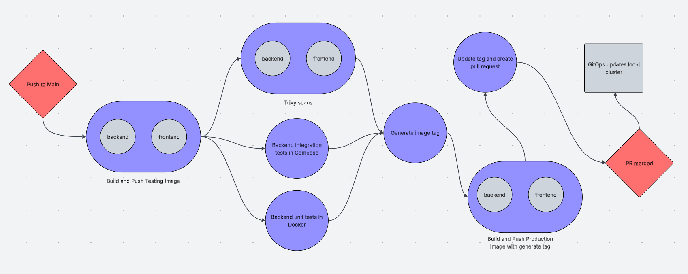

# Traveling-merchant

The main purpose of this project is to apply Kubernetes (K8s) concepts to familiarize oneself with related tools. I watched a K8s video by TechWorld with Nana as a refresher on K8s concepts and followed DevOps directive's Kubernetes course as a project template to implement my full-stack application. Check the sources section at the bottom for the links to both sources.

To prove my originality, the differences between DevOps directive's project (template project) and mine are:

1. Applications are different
2. Use Gateway Api instead of Ingress
3. All services are provided locally
4. Continuous integration is modified

The major difference between the template project's apps and mine is that the frontend and backend are built by me, and the backend uses Redis as a Cache.

The template project uses Ingress as an entry point for requests from a cloud load balancer. In my project, I use Gateway API as the entry point and have a load balancer existing in my bare metal using the helm chart, MetalLB.

Another difference related to the previous difference is that no cloud services are used, and everything is made and run locally from my bare metal. In contrast, the template project can create clusters and use an external load balancer from the following cloud services: CIVO and GKE.

The CI of this project is added from the template project by testing the backend app and performing security scans on both images for the backend and frontend apps. This addition was made from the previous project that can be found at david-alej/traveling-merchant-ci github repository, which provides the source from which I modeled it, Bret Fisher's Docker CI automation.

## Features & Usage

All the features are separated and ordered by the numbered subdirectories starting with one. All subdirectories are well documented by following the tasks on the parent Taskfile, then going to the nested Taskfiles.

### 1. Kind

Kind is a tool that creates a local Kubernetes cluster using Docker. Starting by generating a custom config file used to create a cluster. The cluster is created with a name for either the staging or production environment.

### 2. Full-stack Application

This directory houses the backend and frontend applications, the PostgreSQL database used by the backend application, and Redis used by the backend application as a cache. Starting with the root Taskfile:

1. Create a custom buildx-builder - buildx is a Docker CLI plugin that extends the Docker build command. With this, we can create images for the applications that have architecture of Linux/amd64 and Linux/arm64.
2. Run a local Docker registry - Optional for wanting to circumvent pushing images to remote DockerHub that require Docker credentials.

The rest of the tasks are for running the full stack application using Docker, where the Docker Compose is generated and then run using the up task and removed using the down task.

The nested tasks that are required for the next features are building a container image with multi-architecture. To run the full stall application, all components can be run on Docker except for the backend, which has to be run locally to avoid delving into Docker networks.

### 3. Kuberentes

This houses all k8s manifests to run the cluster by using the traditional "kubectl apply -f" and helm charts. This cluster uses Gateway Api to expose the cluster to a load balancer created by the helm chart MetalLB. To apply tasks correctly, follow or use the task apply-all. All the helm charts used are:

- PostgreSQL - an object-relational database system
- Redis - used as a cache.
- MetalLB - a local external load balancer.
- Fabric - gateway api controller from nginx.

### 4. Auxiliary Tools

This houses helm charts operators' usages of:

- CloudNativePG - a fully managed PostgreSQL cluster.
- Trivy - an operator that automatically performs security scans on all images in the Kubernetes cluster.

### 5. Developing Apps in a K8s cluster

Uses Tilt, a local k8s development tool for automating tasks, to monitor logs of backend and frontend apps in the cluster and live update app changes to the cluster.

### 6. Cluster in different environments

Use kluctl, a local k8s development tool for deploying, to deploy the same cluster in different environments, staging and production.

### 7. CI/CD

Keeping in mind CI/CD, continuous integration (CI) and continuous delivery (CD) were implemented using GitHub Actions and kluctl gitops, respectively.

_This is the CI/CD diagram created from lucid.app. It shows the CI from GitHub Actions and the CD from GitOps._

The CI is represented by the blue shapes in the diagram above. It begins by building a testing image for both the frontend and backend applications that is pushed to DockerHub. In parallel, unit tests are run on the backend image, integration tests are run on the backend image, and a Trivy security scan is run for both images. An image tag is generated using the most recent tag of the repository as a prefix. Then production images are built, using the previously generated tag, for both the backend and frontend app, where each app has an image that can work for Linux/amd64 and Linux/arm64. Lastly, a pull request is made that updates the images tags to the most recent tag (i.e., the previous generated tag) for the kluctl k8s cluster deployment in different environments, where staging tags are always updated, and production is updated only when there is a release tag made.

For CD, kluctl gitops is used to scan this GitHub repository for changes and implement them into the chosen environment cluster. A web UI is used to view information on the state of the cluster and GitOps. To use:

1. Deploy a cluster for either staging or production
2. Get the web ui password
3. Port forward web UI
4. Visit the web UI in a browser on the URL "localhost:8080"
5. Log in using "admin" as the user and use the password from step 2

## Technologies

The technologies and/or frameworks used in this project will be sectioned off. The root directory of this repository focuses on:

- Taskfile - task build tool
- Devbox - a CLI that lets you create isolated shells for development.
- Docker - open source platform for containers
- Visual Studio Code - code editor

For the backend:

- Swagger - a suite of tools for documenting APIs
- Mocha/Chai/Axios - a suite of npm modules used for making tests
- Sequelize - object-related mapping (ORM) for PostgreSQL
- Express.js - web application framework
- nvm - nodejs version control
- PostgreSQL - relational database
- Redis - non-relational database
- Node.js (22.16.0) - JavaScript runtime
- Visual Studio Code - code editor

For the frontend:

- Axios - making api requests
- React.js - front-end web application framework
- nvm - Node.js version control
- Node.js (22.16.0) - JavaScript runtime
- Visual Studio Code - code editor

## License

MIT license

The license is in the text file "LICENSE.txt" in the repository.

## What's Next

Originally, I planned to apply Kubernetes knowledge and try to apply message brokers, search engines, and real-time data. Although the template project introduced me to so many good tools, it took some time to learn, so I will apply message brokers, search engines, and real-time data in my next project.

## Sources

The following are the sources I used to learn and implement new topics or technologies that are not documented:

- [TechWorld with Nana Kuberentes video](https://www.youtube.com/watch?v=X48VuDVv0do) - This is a video on Kubernetes concepts and small demos of a minikube k8s cluster.
- [DevOps Directive Kubernetes course](https://courses.devopsdirective.com/docker-beginner-to-pro/lessons/00-introduction/01-main) - This is a great guide on kubernetes. This made me aware of new Technologies such as Taskfile, devbox, Tilt, kluctl, k9s, and kubectx.
- [Bret Fisher Docker CI Automation](https://github.com/BretFisher/docker-ci-automation) - This is a feature guide on how to use GitHub actions with Docker to automate the CI workflow. Used the "99-parallelize-jobs.yaml" as a template for my backend that also has k8s manifests.
